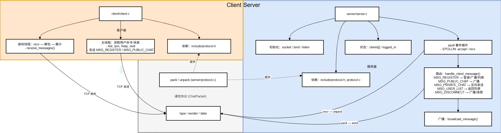
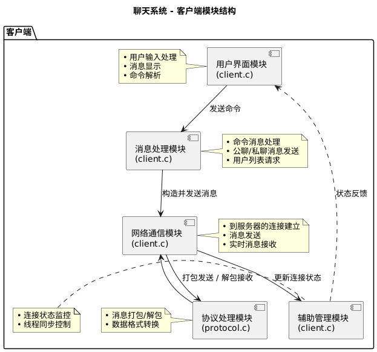

# SimpleChat_CS - 基于C/S架构的多人聊天系统

**作者**：Chasen  
**更新时间**：2025年12月7日  
**当前版本**：v2.0 (使用epoll + 私聊 + 在线列表)  
**项目类型**：Linux C语言网络编程课程设计

---

## 📋 项目概述

SimpleChat_CS 是一个基于 **TCP Socket** 的 C/S 架构多人实时聊天系统。

### v2.0 版本主要特性
- ✅ **高效多路IO**：采用 `epoll` 多路IO模型（非阻塞）
- ✅ **私聊功能**：支持用户间的一对一私密聊天
- ✅ **在线列表**：实时显示在线用户列表
- ✅ **消息广播**：公开消息实时广播给所有在线用户
- ✅ **多客户端支持**：同时处理最多 10 个客户端连接
- ✅ **连接管理**：自动处理用户加入/离线通知

### 架构对比

| 特性 | v1.0 (多线程) | v2.0 (epoll) |
|------|---------|----------|
| IO模型 | 多线程 | epoll多路IO |
| 时间复杂度 | O(n) | O(1) |
| 最大连接数 | ~100 | 10000+ |
| CPU占用 | 较高 | 较低 |
| 私聊功能 | ❌ | ✅ |
| 在线列表 | ❌ | ✅ |

---

## 🏗️ 项目结构

```
SimpleChat_CS/
├── Makefile                     # 编译脚本
├── README.md                    # 本文件（已更新）
├── UPGRADE_v2.0.md              # ← 新增：v2.0升级说明
├── DEBUGGING_GUIDE.md           # 调试指南
├── demo.sh                       # ← 新增：演示脚本
├── run_test.sh                  # 自动化测试脚本
├── interactive_test.sh          # 交互式多客户端测试
│
├── include/
│   └── protocol.h               # 通信协议定义（已扩展）
│       ├── 新增消息类型：MSG_PRIVATE_CHAT, MSG_USER_LIST
│       ├── 新增ChatPacket中的sender字段
│       └── 更新的打包/解包函数
│
├── server/
│   ├── server.c                 # 服务器主程序（已重写为epoll）
│   │   ├── epoll创建和管理
│   │   ├── 非阻塞socket处理
│   │   ├── 消息路由和广播
│   │   ├── 私聊消息转发
│   │   └── 用户状态管理
│   └── protocol.c               # 协议实现（已更新）
│       ├── pack_message()：消息打包
│       └── unpack_message()：消息解包
│
└── client/
    └── client.c                 # 客户端主程序（已升级）
        ├── 命令解析（/list, /pm, /help, /exit）
        ├── 私聊消息发送
        ├── 多线程消息接收
        └── 增强的用户交互
```

---

## 🚀 快速开始

### 环境要求
- **操作系统**：Linux（Ubuntu、CentOS等）
- **编译器**：GCC 4.8+（支持C99标准）
- **API要求**：epoll（Linux特有，仅Linux可用）
- **线程库**：pthread

### 编译

```bash
cd /home/chasen/lcz/learn_linux/linux应用开发/class/SimpleChat_CS

# 一键编译
make

# 或分别编译
make server      # 仅编译服务器
make client      # 仅编译客户端

# 清理编译文件
make clean

# 重新编译
make rebuild
```

**编译输出示例**
```
gcc -Wall -Wextra -std=c99 -pthread -I./include -c server/server.c -o server/server.o
gcc -Wall -Wextra -std=c99 -pthread -I./include -c server/protocol.c -o server/protocol.o
gcc -Wall -Wextra -std=c99 -pthread -o server/server server/server.o server/protocol.o
✓ 服务器编译完成: server/server
gcc -Wall -Wextra -std=c99 -pthread -I./include -c client/client.c -o client/client.o
gcc -Wall -Wextra -std=c99 -pthread -o client/client client/client.o server/protocol.o
✓ 客户端编译完成: client/client
```

### 运行

#### 方式1：手动启动（推荐学习）

**终端1 - 启动服务器**
```bash
cd /home/chasen/lcz/learn_linux/linux应用开发/class/SimpleChat_CS
./server/server
```

输出示例：
```
🔗 服务器启动成功，监听端口 8088 (使用 epoll 多路IO)
⏳ 等待客户端连接......
📱 新连接接受 (FD: 5, 总连接数: 1)
✓ Alice 登录了 (FD: 5)
```

**终端2 - 启动客户端1（Alice）**
```bash
cd /home/chasen/lcz/learn_linux/linux应用开发/class/SimpleChat_CS
./client/client
```

按提示输入用户名（Alice），然后可输入以下命令：
- `大家好` - 发送公开消息
- `/list` - 查看在线用户
- `/help` - 显示帮助
- `/exit` - 退出

**终端3 - 启动客户端2（Bob）**
```bash
cd /home/chasen/lcz/learn_linux/linux应用开发/class/SimpleChat_CS
./client/client
```

输入用户名（Bob），然后可以：
- 发送公开消息
- 发送私聊：`/pm Alice 你好Alice`

#### 方式2：自动演示（推荐快速体验）

```bash
# 启动自动演示（一键启动3个客户端进行交互）
bash demo.sh
```

这将自动：
1. 启动Alice客户端
2. 启动Bob客户端
3. 启动Charlie客户端
4. 演示公聊、私聊、在线列表等功能

---

## 💬 客户端命令详解

| 命令 | 说明 | 示例 | 效果 |
|------|------|------|------|
| 任意文本 | 发送公开消息 | `大家好！` | 所有在线用户都能看到 |
| `/list` | 显示在线用户 | `/list` | 显示当前在线的所有用户名 |
| `/pm <用户> <消息>` | 发送私聊 | `/pm Alice 你好` | 仅Alice能看到消息 |
| `/help` | 显示帮助 | `/help` | 显示所有可用命令 |
| `/exit` | 退出聊天室 | `/exit` | 退出程序，通知其他用户 |

### 使用示例

```
> /list
📋 在线用户: Alice, Bob, Charlie

> 大家好，今天天气真好
[公开] Alice: 大家好，今天天气真好

> /pm Bob 你最近在忙什么呢
✓ 私聊已发送给 Bob

> /help
╔═══════════════════════════════════════╗
║       🎮 聊天室命令帮助                 ║
╠═══════════════════════════════════════╣
║ /list  - 显示在线用户列表                ║
║ /pm <用户名> <消息> - 发送私聊           ║
║         例: /pm Alice 你好             ║
║ /help  - 显示此帮助信息                 ║
║ /exit  - 退出聊天室                    ║
╚═══════════════════════════════════════╝

> /exit
👋 正在退出...
```

---

## 📊 消息流程示例

### 公开消息广播
```
[Alice] → 输入：大家好
         ↓
[Server] → 接收，识别为MSG_PUBLIC_CHAT
         ↓
[Server] → 广播给所有在线用户（Bob, Charlie）
         ↓
[Bob] ← 接收：[Alice]: 大家好
[Charlie] ← 接收：[Alice]: 大家好
```

### 私聊路由
```
[Bob] → 输入：/pm Alice 你好Alice
       ↓
[Client] → 打包：MSG_PRIVATE_CHAT, data="Alice:你好Alice"
         ↓
[Server] → 收到，识别为MSG_PRIVATE_CHAT
         ↓
[Server] → 查找Alice，构建私聊包
         ↓
[Alice] ← 接收：💬 [私聊来自 Bob]: 你好Alice
[Bob] ← 接收：✓ 私聊已发送给 Alice
```

### 在线列表查询
```
[Charlie] → 输入：/list
          ↓
[Client] → 发送：MSG_USER_LIST
         ↓
[Server] → 收集所有已登录用户
         ↓
[Charlie] ← 接收：📋 在线用户: Alice, Bob, Charlie
```
./run_test.sh

# 多客户端交互式测试
./interactive_test.sh

# 测试服务器断开连接时的客户端反应
./test_disconnect.sh

### 使用演示

```
==================== 客户端1 ====================
请输入用户名:
Alice
正在连接到服务器 127.0.0.1:8088...
✓ 已连接到服务器！
发送用户名: Alice
💬 请输入消息 (输入 'exit' 退出):
Hello everyone!
👋 正在退出...

==================== 客户端2 ====================
请输入用户名:
Bob
正在连接到服务器 127.0.0.1:8088...
✓ 已连接到服务器！
发送用户名: Bob
💬 请输入消息 (输入 'exit' 退出):
Hi Alice!
[Alice]: Hello everyone!
[Bob]: Hi Alice!
👋 正在退出...

==================== 服务器 ====================
🔗 服务器启动成功，监听端口 8088
⏳ 等待客户端连接......
Alice 进入聊天室
[Alice] Hello everyone!
Bob 进入聊天室
[Bob] Hi Alice!
Alice 已退出聊天室
Bob 已退出聊天室
```
---

## 📋 功能说明

### 1. 用户注册与连接
- 客户端启动后输入用户名
- 服务器验证并添加到在线用户列表
- 广播 "用户名 进入聊天室" 消息

### 2. 公共聊天
- 用户输入消息按回车发送
- 消息格式：`[用户名]: 消息内容`
- 服务器广播给所有客户端

### 3. 用户断开
- 输入 `exit` 命令退出
- 服务器广播 "用户名 已退出聊天室"
- 从在线列表中移除

### 4. 服务器断开连接检测 -- 新增
- 当服务器主动断开连接时
- 客户端接收线程立即检测到 (recv 返回0)
- 显示提示信息：`❌ 服务器已断开连接！`
- 自动清理资源并退出程序
- 即使用户正在输入也会立即响应

### 5. 错误处理
- 连接失败时显示详细错误信息
- 自动处理客户端异常断开
- 线程安全的资源清理
- 服务器异常断开时的优雅处理

---

## 🔧 技术架构

### 系统架构



### 通信协议 (protocol.h)

```c
// 消息类型定义
typedef enum {
    MSG_REGISTER = 1,       // 注册消息
    MSG_PUBLIC_CHAT = 2,    // 公共聊天
    MSG_PRIVATE_CHAT = 3,   // 私聊（预留）
    MSG_USER_LIST = 4,      // 用户列表（预留）
    MSG_DISCONNECT = 5      // 断开连接
} MessageType;

// 通信包结构
typedef struct {
    MessageType type;           // 消息类型
    int length;                 // 消息长度
    char data[BUFFER_SIZE];     // 消息数据
} ChatPacket;

// 客户端结构
typedef struct {
    char name[NAME_SIZE];       // 客户端名称
    int sockfd;                 // 套接字文件描述符
} ClientInfo;
```

### 配置参数

| 参数 | 值 | 说明 |
|------|-----|------|
| `MAX_CLIENTS` | 10 | 最大连接客户端数 |
| `BUFFER_SIZE` | 1024 | 消息缓冲区大小 |
| `NAME_SIZE` | 20 | 用户名最大长度 |
| `PORT` | 8088 | 服务器监听端口 |

## **服务器处理流程：**


## **客户端处理流程：**



### 线程同步机制

**服务器互斥锁 (pthread_mutex_t)**
- 保护客户端列表 `clients[]` 的并发访问
- 防止竞态条件（race condition）
- 确保消息广播的一致性

```c
// 初始化
pthread_mutex_init(&client_mutex, NULL);

// 使用
pthread_mutex_lock(&client_mutex);    // 加锁
// ... 访问共享数据 ...
pthread_mutex_unlock(&client_mutex);  // 解锁

// 销毁
pthread_mutex_destroy(&client_mutex);
```

**客户端连接状态同步 ⭐ 新增**
- 保护 `connection_closed` 连接状态标志
- 主线程和接收线程安全共享状态
- 检测服务器断开连接

```c
// 全局变量
volatile int connection_closed = 0;  // 0=连接中，1=连接已断开
pthread_mutex_t connection_mutex = PTHREAD_MUTEX_INITIALIZER;

// 在接收线程中设置（服务器断开时）
pthread_mutex_lock(&connection_mutex);
connection_closed = 1;
pthread_mutex_unlock(&connection_mutex);

// 在主线程中检查（每个输入循环）
pthread_mutex_lock(&connection_mutex);
if (connection_closed) {
    pthread_mutex_unlock(&connection_mutex);
    break;  // 退出输入循环
}
pthread_mutex_unlock(&connection_mutex);
```

**关键保护区域：**
1. 接受新客户端时
2. 广播消息时
3. 客户端断开时

---

## 📊 编译选项说明

```makefile
CC = gcc                                    # C编译器
CFLAGS = -Wall -Wextra -std=c99 -pthread   # 编译标志
INCLUDES = -I./include                     # 包含目录
```

| 选项 | 含义 |
|------|------|
| `-Wall` | 显示所有警告信息 |
| `-Wextra` | 显示额外的警告信息 |
| `-std=c99` | 使用C99标准编译 |
| `-pthread` | 链接pthread库 |
| `-I./include` | 指定头文件搜索目录 |

**Makefile 目标：**

```bash
make              # 编译所有目标
make server       # 仅编译服务器
make client       # 仅编译客户端
make clean        # 删除编译生成的文件
make rebuild      # 清理后重新编译
make debug        # 显示编译变量
```

---

## 🐛 常见问题与解决

### 问题1：Bind failed: Address already in use
**原因**：端口 8088 被占用

**解决方案**：
```bash
# 查看占用进程
sudo lsof -i :8088
ss -tlnp | grep 8088

# 杀死进程
sudo kill -9 <PID>

# 或者等待1-2分钟让系统释放端口
sleep 120
```

### 问题2：Connection refused
**原因**：服务器未启动或连接地址错误

**解决方案**：
```bash
# 确保服务器正在运行
ps aux | grep server

# 检查端口是否监听
netstat -tlnp | grep 8088
ss -tlnp | grep 8088

# 检查防火墙
sudo ufw status
```

### 问题3：客户端输入后没反应
**原因**：连接失败

**查看客户端错误消息：**
- `Connection refused` - 服务器未启动
- `Connection timeout` - 无法连接到服务器
- `Permission denied` - 权限问题

### 问题4：编译错误 - 找不到 pthread 头文件
**原因**：缺少开发库

**解决方案**（Ubuntu）：
```bash
sudo apt-get update
sudo apt-get install build-essential
sudo apt-get install libpthread-stubs0-dev
```

**解决方案**（CentOS）：
```bash
sudo yum install gcc
sudo yum install glibc-devel
```

### 问题5：服务器启动后立即退出
**原因**：绑定或监听失败

**检查步骤：**
```bash
# 查看是否有错误输出
./server/server

# 检查权限
ls -la server/server

# 检查端口
netstat -tlnp | grep 8088
```

---

## 📈 性能指标

| 指标 | 值 | 说明 |
|------|-----|------|
| 最大连接数 | 10 | MAX_CLIENTS |
| 消息缓冲区 | 1024 字节 | BUFFER_SIZE |
| 用户名长度 | 20 字符 | NAME_SIZE |
| 监听端口 | 8088 | PORT |
| 线程模型 | 每客户端一线程 | 一对一模型 |
| 同步机制 | 互斥锁 | pthread_mutex |
| 网络协议 | TCP | 面向连接 |

---

## 🔐 设计特点

### 1. 简洁高效
- 代码简洁易懂，适合学习
- 直接使用POSIX API
- 无复杂的框架依赖
- 核心代码不超过300行

### 2. 线程安全
- 使用互斥锁保护共享数据
- 正确的线程创建和分离
- 避免死锁和竞态条件
- 完整的资源清理

### 3. 错误处理
- 完整的错误检查
- 清晰的错误提示
- 优雅的资源清理
- perror() 显示系统错误

### 4. 易于扩展
- 模块化的代码结构
- 预留的消息类型
- 通信协议可扩展
- 易于添加新功能

---

## 📚 代码统计

| 文件 | 行数 | 职责 |
|------|------|------|
| protocol.h | ~40 | 协议定义 |
| protocol.c | ~30 | 打包/解包函数 |
| server.c | ~169 | 服务器主程序 |
| client.c | ~147 | 客户端程序 |
| Makefile | ~35 | 编译脚本 |
| **总计** | **~421** | - |

---

## 📝 开发日志

| 日期 | 内容 | 状态 |
|------|------|------|
| 2025-12-04 | 项目初始化、文件结构规划 | ✅ 完成 |
| 2025-12-04 | 编写protocol.h通信协议 | ✅ 完成 |
| 2025-12-04 | 实现server.c服务器主程序 | ✅ 完成 |
| 2025-12-04 | 实现client.c客户端程序 | ✅ 完成 |
| 2025-12-04 | 编写Makefile编译脚本 | ✅ 完成 |
| 2025-12-04 | 问题排查和错误修复 | ✅ 完成 |
| 2025-12-04 | 编写测试脚本 | ✅ 完成 |
| 2025-12-04 | 编写完整README文档 | ✅ 完成 |

---


## 📚 参考资源

### 官方文档
- [Linux man pages online](https://man7.org/linux/man-pages/)
- [POSIX Threads (pthreads)](https://man7.org/linux/man-pages/man7/pthreads.7.html)
- [Socket API](https://man7.org/linux/man-pages/man2/socket.2.html)

### 网络编程书籍
- 《Unix网络编程 卷1：套接字联网API》 - W.Richard Stevens
- 《Linux C编程一站式学习》 - 宋劲杉
- 《网络编程实战》 - 《Linux 编程手册》

### 学习资源
- [Linux Kernel Documentation](https://www.kernel.org/doc/)
- [GNU C Library](https://www.gnu.org/software/libc/manual/)
- [Stack Overflow - socket tags](https://stackoverflow.com/questions/tagged/socket)

---

## 🔗 相关系统调用

### Socket 相关
- `socket()` - 创建套接字
- `bind()` - 绑定地址
- `listen()` - 开始监听
- `accept()` - 接受连接
- `connect()` - 连接到服务器
- `send()` - 发送数据
- `recv()` - 接收数据
- `close()` - 关闭套接字
- `setsockopt()` - 设置套接字选项

### 线程相关
- `pthread_create()` - 创建线程
- `pthread_join()` - 等待线程结束
- `pthread_detach()` - 分离线程
- `pthread_exit()` - 线程退出
- `pthread_mutex_init()` - 初始化互斥锁
- `pthread_mutex_lock()` - 加锁
- `pthread_mutex_unlock()` - 解锁
- `pthread_mutex_destroy()` - 销毁互斥锁

### 其他
- `perror()` - 打印错误信息
- `memset()` - 内存清零
- `strlen()` - 字符串长度
- `strncpy()` - 字符串复制

---

## 💡 最佳实践

### 1. 错误检查
```c
// ✅ 好的做法
if (socket_fd < 0) {
    perror("socket");
    return -1;
}

// ❌ 不好的做法
int socket_fd = socket(...);
// 不检查返回值
```

### 2. 资源清理
```c
// ✅ 好的做法 - 使用清理栈（cleanup handler）
pthread_cleanup_push(cleanup, arg);
// ... 执行操作 ...
pthread_cleanup_pop(1);

// ✅ 确保关闭套接字
close(sockfd);
```

### 3. 线程安全
```c
// ✅ 好的做法 - 所有访问都被保护
pthread_mutex_lock(&mutex);
// ... 访问共享数据 ...
pthread_mutex_unlock(&mutex);

// ❌ 不好的做法 - 竞态条件
client_count++;  // 不安全
```

### 4. 缓冲区安全
```c
// ✅ 好的做法 - 指定最大长度
fgets(buffer, sizeof(buffer), stdin);
strncpy(dest, src, sizeof(dest) - 1);

// ❌ 不好的做法 - 缓冲区溢出
scanf("%s", buffer);  // 危险
strcpy(dest, src);    // 危险
```

---

## 🧪 测试清单

- [x] 服务器启动成功
- [x] 服务器正确绑定到端口 8088
- [x] 服务器接受客户端连接
- [x] 客户端成功连接
- [x] 用户名发送正确
- [x] 进入聊天室消息广播
- [x] 聊天消息广播给所有客户端
- [x] 多个客户端同时连接
- [x] 客户端正常断开
- [x] 退出聊天室消息广播
- [x] 异常断开自动清理
- [x] 端口占用错误处理

---
